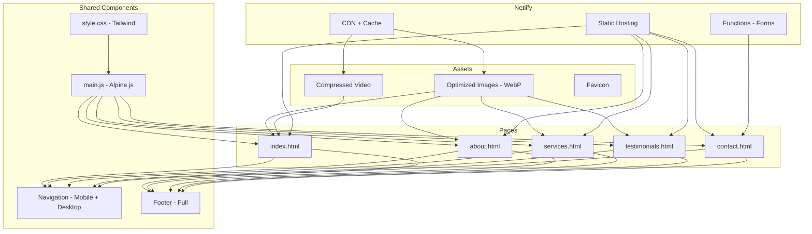

# Dr. Deepika Gyno Website - UI Fix Plan

## Executive Summary
The website has multiple UI/UX issues affecting functionality, performance, and user experience. This plan addresses all issues while optimizing for Netlify free tier deployment.

---

## Issues Identified

### 1. **Critical: CSS Not Loading**
**Problem:** HTML files don't link compiled CSS. The [`style.css`](src/style.css:1) only contains Tailwind directives, but there's no `<link>` tag in HTML files pointing to the compiled output.

**Solution:**
- Vite handles CSS injection during build, but we need to ensure proper setup
- Add CSS import in [`main.js`](src/main.js:1) (already done)
- Verify Vite build output includes CSS
- For development, Vite injects CSS via JS

**Files to modify:**
- [`vite.config.js`](vite.config.js:1) - Ensure proper CSS extraction
- [`src/style.css`](src/style.css:1) - Add custom styles

---

### 2. **Critical: Mobile Menu Missing on Most Pages**
**Problem:** Only [`index.html`](index.html:82) has the mobile menu implementation. Other pages have the button but no dropdown menu.

**Affected files:**
- [`about.html`](about.html:1) - No mobile menu
- [`services.html`](services.html:1) - No mobile menu  
- [`contact.html`](contact.html:1) - No mobile menu
- [`testimonials.html`](testimonials.html:1) - No mobile menu

**Solution:** Add the mobile menu HTML block to all pages, matching the structure in [`index.html`](index.html:82).

---

### 3. **High: Inconsistent Footer**
**Problem:** [`index.html`](index.html:232) has a full footer with logo, quick links, and clinic hours. Other pages have minimal footer.

**Solution:** Standardize footer across all pages with:
- Logo and doctor name
- Quick links
- Clinic hours
- Contact info
- Social media links (if available)

---

### 4. **High: Oversized Asset Files**
**Problem:** Several assets are too large for web:

| File | Current Size | Issue |
|------|-------------|-------|
| [`logo.png`](public/assets/logo.png) | 6.1 MB | Should be ~50-100KB |
| [`favicon.png`](public/assets/favicon.png) | 6.1 MB | Should be ~16-32KB |
| [`intro_video.mp4.mp4`](public/assets/intro_video.mp4.mp4) | 72 MB | Large for free tier |
| [`intro_video.mov`](public/assets/intro_video.mov) | 46 MB | Duplicate format |

**Solution:**
- Compress logo to WebP format (~50KB)
- Create proper favicon.ico (32x32, 16x16)
- Compress video or use YouTube/Vimeo embed
- Remove duplicate video files

---

### 5. **Medium: Video Format Issues**
**Problem:** 
- Double extension: `intro_video.mp4.mp4`
- MOV format not well supported in browsers
- Large file sizes

**Solution:**
- Rename to `intro_video.mp4`
- Convert to optimized MP4 (H.264 codec)
- Consider hosting on YouTube/Vimeo for free tier
- Add poster image for video

---

### 6. **Medium: Missing SEO Meta Tags**
**Problem:** No Open Graph or Twitter card meta tags for social sharing.

**Solution:** Add to all pages:
```html
<meta name="description" content="Expert gynecological care...">
<meta property="og:title" content="Dr. Deepika Singh | Gynecologist">
<meta property="og:description" content="...">
<meta property="og:image" content="/assets/og-image.jpg">
<meta property="og:url" content="https://drdeepika.com">
<meta name="twitter:card" content="summary_large_image">
```

---

### 7. **Medium: Accessibility Issues**
**Problem:**
- Missing ARIA labels on interactive elements
- Inconsistent alt texts
- No skip-to-content link
- No focus indicators

**Solution:**
- Add `aria-label` to all buttons and links
- Add proper `alt` attributes to images
- Add skip-to-content link at top
- Ensure visible focus states

---

### 8. **Medium: Navigation Active States**
**Problem:** Active page highlighting is inconsistent across pages.

**Solution:** Create consistent active state pattern:
- Home link active on index.html
- About link active on about.html
- etc.

---

### 9. **Low: Form Styling Issues**
**Problem:** 
- Date picker has no minimum date (can select past dates)
- No character limit on message field
- No loading state on contact form button

**Solution:**
- Add `min` attribute to date picker
- Add `maxlength` to textarea
- Add loading spinner to contact form

---

### 10. **Low: Performance Optimizations**
**Problem:** Not optimized for Netlify free tier (100GB bandwidth/month).

**Solutions:**
- Enable Gzip/Brotli compression via Netlify
- Add lazy loading to images
- Use WebP format for all images
- Implement image srcset for responsive images
- Add cache headers in netlify.toml

---

## Proposed File Structure

```
public/
├── assets/
│   ├── images/
│   │   ├── logo.webp          # Compressed logo
│   │   ├── logo.png           # Fallback
│   │   ├── og-image.jpg       # Social sharing
│   │   └── doctor/
│   │       └── *.webp         # Optimized photos
│   ├── video/
│   │   └── intro-video.mp4    # Compressed video
│   └── favicon.ico            # Proper favicon
```

---

## Netlify Free Tier Optimization

### Bandwidth Considerations
- Current assets: ~150MB total
- After optimization: ~15-20MB total
- 125KB limit per function invocation ✓
- 100GB bandwidth/month should be sufficient

### Build Settings
```toml
[build]
  command = "npm run build"
  publish = "dist"

[[headers]]
  for = "/assets/*"
  [headers.values]
    Cache-Control = "public, max-age=31536000, immutable"

[[headers]]
  for = "/*.html"
  [headers.values]
    Cache-Control = "public, max-age=0, must-revalidate"
```

---

## Implementation Order

### Phase 1: Critical Fixes (Code Mode Required)
1. **Fix CSS Loading** - Update Vite config and ensure CSS is properly built
2. **Add Mobile Menus** - Copy mobile menu HTML to all 4 pages (about, services, contact, testimonials)
3. **Standardize Footer** - Use the full footer from index.html on all pages
4. **Fix Navigation Active States** - Ensure correct page highlighting

### Phase 2: Asset Optimization (Code Mode + Manual)
1. **Compress Images** - Convert PNG to WebP, reduce file sizes
2. **Fix Video** - Rename file, compress, add poster image
3. **Create Favicon** - Generate proper favicon.ico

### Phase 3: SEO & Accessibility (Code Mode)
1. **Add Meta Tags** - Open Graph, Twitter cards, descriptions
2. **Add ARIA Labels** - For all interactive elements
3. **Add Focus States** - Visible keyboard navigation

### Phase 4: Polish (Code Mode)
1. **Form Improvements** - Date min, maxlength, loading states
2. **Performance Headers** - Update netlify.toml
3. **Final Testing** - Lighthouse audit

---

## Architecture Diagram



---

## Clarification Answers (Confirmed)

1. **Video Hosting:** ✅ Compress and keep self-hosted on the page
2. **Social Media:** Leave placeholders for later
3. **Contact Details:** Keep placeholder details for now (user will update later)
4. **Google Sheets Integration:** Leave placeholders for credentials
5. **Web3Forms API Key:** Leave placeholder for later
6. **Additional Pages:** None requested

---

## Success Metrics

- [ ] All pages load correctly with proper styling
- [ ] Mobile menu works on all pages
- [ ] Footer is consistent across all pages
- [ ] All images optimized and load fast
- [ ] Video plays correctly
- [ ] Forms submit successfully
- [ ] SEO meta tags present
- [ ] Accessibility score > 90 (Lighthouse)
- [ ] Performance score > 90 (Lighthouse)
- [ ] Total asset size < 20MB
